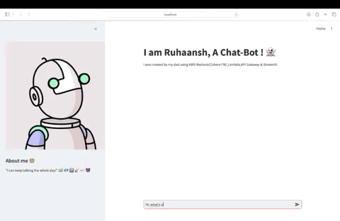

# GenAI Project using AWS Bedrock
This is a simple GenAI project which has different Python classes which are using AWS Bedrock. Each classes are created for a seperate use case. 

Disclaimer : These are created just for my learning purpose. 

## Project overview:

## 1. learning/awsBedrock/apiGateway/ruhaanshChatBot.py 

This is a simple but fully functional chatbot created for my kid for Q&A for fun. 
Key components & AWS services used:
##### 1. AWS Bedrock ( Claude FM) - The LLM foundation model named Claude provided by Cohere 

##### 2. AWS Lambda ( To interact with AWS Bedrock) - Refer sample python class `lambda.py` for code used for lambda code

##### 3. AWS API Gateway - Attached with lambda function for api call 

##### 4. Python's Streamlit - For UI Chatbot

## 2. learning/awsBedrock/langchain/langchainChatbotBedrock.py 

This basic chatbot was created using python's orchestration tool called langchain. It integrates well with AWS bedrock LLMs and also have feature to be used for RAG ( vector / embeddings/ vector store etc. ). 
Key components & AWS services used:
##### 1. AWS Bedrock ( Claude FM) - The LLM foundation model named Claude provided by Cohere 

##### 2. Python's LangChain ( To interact with AWS Bedrock) 

##### 3. Python's Streamlit - For UI Chatbot

## 3. learning/awsBedrock/rag/testAwsRAGChatbot.py 

This chatbot was created with purpose to test RAG ( Retrieve. Augment. Generate) feature with FM of bedrock. Key components & AWS services used:
##### 1. AWS Bedrock ( Titan FM) - The LLM foundation model named Claude provided by Amazon for embedding 

##### 2. AWS Knowledge base ( To interact with AWS Bedrock and provide RAG approach for contextual responses from users prompts). AWS KB automatically creates embeddings with supported FM ( e.g. Amazon's Titan)/ vector stores and open search serverless Datasources. If not used, we have to use langchain for manual data ingestion and vector handling. 

##### 3. AWS S3 ( Knowledge base will access S3 locations where data will be kept) 

##### 4. Python's Streamlit - For UI Chatbot

## Pre-requisite  

#### 1. Need to have an AWS account 
#### 2. AWS CLI setup 

## Install packages :

`pip3 install -r requirements.txt `

## Run & Test :
We can run all those files using streamlit as shown below

`python3 -m streamlit run learning/awsBedrock/apiGateway/ruhaanshChatBot.py`

`python3 -m streamlit run learning/awsBedrock/langchain/langchainChatbotBedrock.py`

`python3 -m streamlit run learning/awsBedrock/rag/testAwsRAGChatbot.py`

## Sample ChatBot

Below is the screen recording of chat box created via ruhaanshChatBot.py

